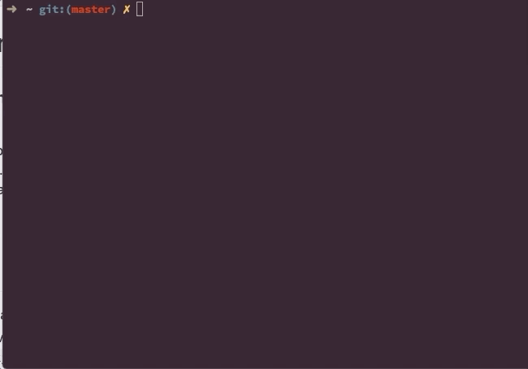

# Cookiecutter template for SuperCollider quarks

### a simple cookiecutter template that will help you automatically crate a basic SuperCollider package (quark).

The point of this is to be able to very easily generate a new quark from the command line like so: `cookiecutter path/to/this/cookiecutter-template`. Cookiecutter will then ask you some questions and from your answers generate a quark file, a class and a help file containing that information.

[read the Cookiecutter docs](https://cookiecutter.readthedocs.io/en/latest/)

# Installation

1. [install cookiecutter](https://cookiecutter.readthedocs.io/en/latest/installation.html) if you haven't already.
2. download this repo and save it somewhere you can easily find it again, for example in your user folder: `git clone https://github.com/madskjeldgaard/cookiecutter-quark`. This will download this repo and put it in `~/cookiecutter-quark`
3. That's it

# Usage

Open up a terminal and move to one of your SuperCollider class extensions folders. If you don't know where these are, you can easily find them by opening up SuperCollider and evaluating the code `Platform.userExtensionsDir`. This will output a path to your class extensions folder in the post window of supercollider. In my case it's `/Users/madskjeldgaard/Library/Application Support/SuperCollider/Extensions`

Then, still in your terminal, move to the abovementioned path like so:
`cd /path/to/scextensions`

And start cookiecutter by typing:
`cookiecutter ~/cookiecutter-quark`

After answering a few questions, cookiecutter will have created a new folder in your user extensions dir with the necessary files. By typing `ls` to list all files and directories you should see it right there.

# A shortcut

Doing the above 3-4 steps can get tedious in itself and sometimes be hard to remember. Let's make this easier by creating a shortcut of sorts.
Given that the path to your cookiecutter-quark folder is still `~/cookiecutter-quark` you can add an alias to your .bashrc file (or similar for zsh and other systems) so that for example you only have to type the word `quark` on the command line to start cookiecutter in your user extensions dir.

1. Open up your .bashrc / .zshrc file using vi: `vi ~/.bashrc`
2. Add the following line to the bottom of the file:
   `alias quark="cd path/to/scextensions; cookiecutter ~/cookiecutter-quark"` (replace "path/to/scextensions" with whatever the path outputted by your Platform.userExtensionsDir was).
3. Save the file (press wq)
4. Reload your .bashrc file: `source ~/.bashrc`

Now, you can type `quark` in your terminal, hit enter and start the cookiecutter program to create your badass new quark.
